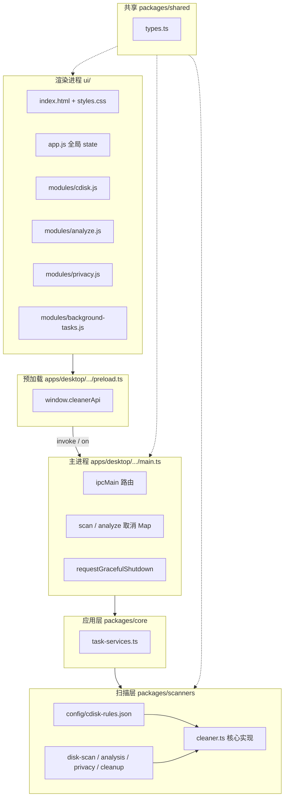
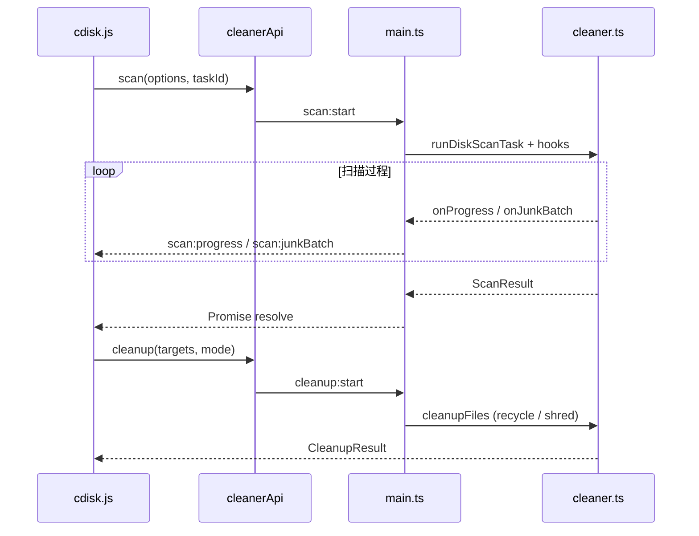
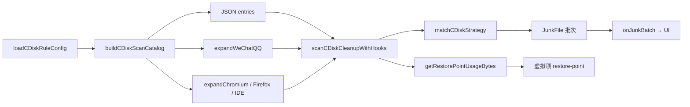
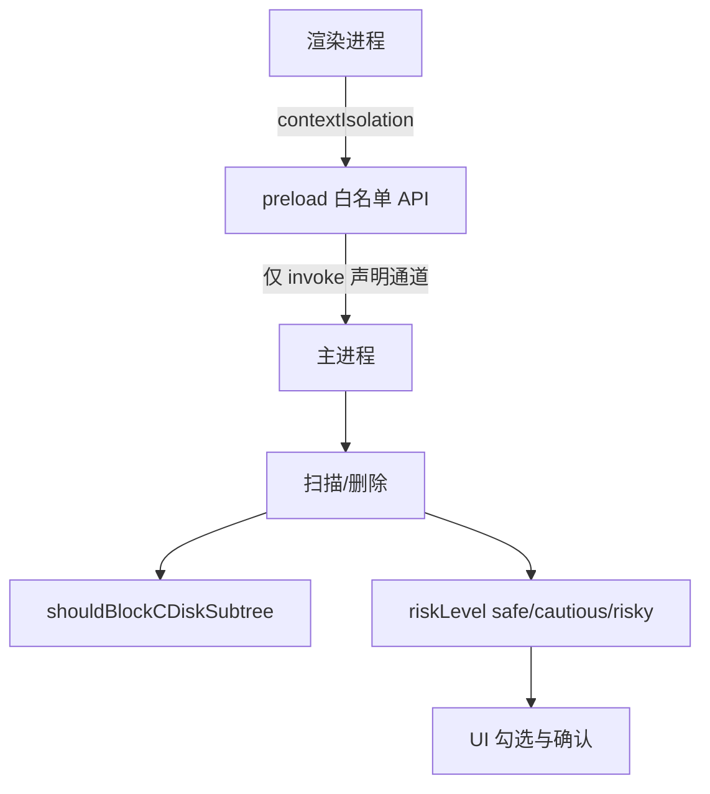
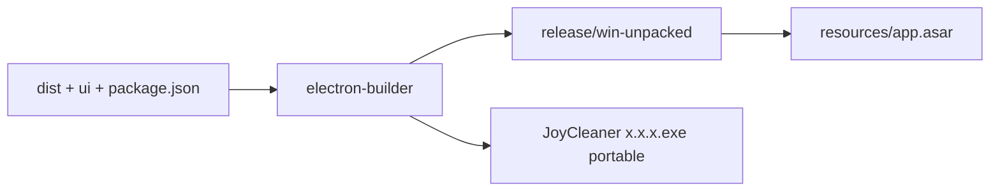

# 架构设计

JoyCleaner 是基于 **Electron** 的 Windows 桌面清理工具。采用「渲染进程 UI + 主进程 IPC + Node 扫描引擎」三层结构；扫描与清理逻辑集中在 `packages/scanners`，通过 JSON 规则与代码扩展协同工作。

> **平台说明**：当前扫描、还原点、微信/QQ 路径等实现面向 **Windows**。macOS / Linux 仅具备 Electron 壳层构建能力，完整功能需在对应平台另行适配。

## 总体分层

## 目录与职责

| 路径 | 职责 |
|------|------|
| `apps/desktop/src/main/main.ts` | 窗口生命周期、IPC 注册、任务取消、退出清理 |
| `apps/desktop/src/main/preload.ts` | `contextBridge` 暴露 `cleanerApi` |
| `apps/desktop/src/main/drives.ts` | 枚举系统盘符 |
| `packages/core/.../task-services.ts` | 扫描/清理/分析任务编排（薄封装） |
| `packages/scanners/src/cleaner.ts` | 公开 API barrel（re-export） |
| `packages/scanners/src/scan/*` | C 盘规则、默认扫描 |
| `packages/scanners/src/analyze/*` | 重复/大文件/空项分析（重复扫描流式分桶） |
| `packages/scanners/src/cleanup/*` | 删除、隐私、粉碎 |
| `packages/scanners/src/internal/*` | 常量、并发、FS 辅助 |
| `packages/scanners/src/platform/*` | 子进程、还原点、回收站注入 |
| `ui/modules/virtual-list.js` | 表格虚拟滚动 |
| `packages/scanners/src/modules/*` | 模块入口（多为 re-export，待细拆） |
| `packages/scanners/src/config/cdisk-rules.json` | C 盘清理静态规则 |
| `packages/shared/src/types.ts` | 跨进程共享 TypeScript 类型 |
| `ui/` | 原生 ES Module 前端，无构建步骤 |

## 磁盘清理数据流

## C 盘扫描流水线

规则策略示例：`all_files`、`temp_like`、`downloads_redundant`、`hiberfil_pagefile_dump` 等，由 `matchCDiskStrategy` 统一匹配。

## 磁盘分析数据流

支持三种工具，均可带 `taskId` 以启用实时推送与取消：

| 工具 | IPC | 实时事件 |
|------|-----|----------|
| 重复文件 | `analyze:duplicates` | `analyze:duplicateBatch`、`analyze:progress` |
| 大文件 | `analyze:bigfiles` | `analyze:junkBatch`、`analyze:progress` |
| 空文件/空目录 | `analyze:empty` | `analyze:junkBatch`、`analyze:progress` |

重复文件采用两阶段：**同大小 → 快速指纹 → SHA256**（受 `maxFilesToHash` 限制）。

## 安全模型

- 渲染进程 **无** `nodeIntegration`。
- 删除模式：`recycle`（`shell.trashItem`）或 `shred`（覆写后删除）。
- 系统敏感目录在扫描遍历阶段拦截，避免误入 `Windows\System32` 等。

## 退出与后台任务

关闭窗口或 `app.quit` 时：

1. `requestGracefulShutdown()` 将所有进行中的 `scan` / `analyze` 任务标记为取消。
2. `killTrackedChildProcesses()` 结束 `vssadmin` / PowerShell 等子进程。
3. 扫描循环检测 `isCancelled` 后抛出 `SCAN_CANCELLED`，IPC Promise 结束，进程可正常退出。

UI 侧 `background-tasks.js` 允许切换面板时不中断扫描；任务状态与侧栏圆点同步。

## 构建产物结构

打包后处理见 `scripts/electron-after-pack.cjs`（裁剪语言包等）。**勿删除 `ffmpeg.dll`**，Chromium 启动依赖该库。

## 路径安全与平台适配

- `packages/scanners/src/path-safety.ts`：扫描根路径校验、清理目标过滤、系统目录拦截。
- `packages/scanners/src/platform/recycle.ts`：回收站删除由主进程注入 `shell.trashItem`，scanners 包不直接依赖 Electron。

## 已知架构债（摘要）

详见 [ROADMAP.md](./ROADMAP.md)：

- `cleaner.ts` 体量仍较大（~2100 行），`modules/*` 尚未完全拆分。
- 微信/QQ 因版本差异可能存在未覆盖目录，需持续补充规则。
