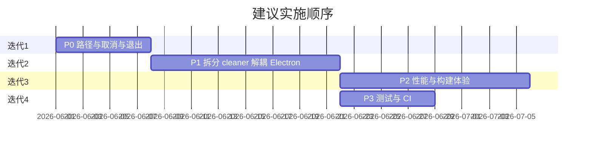

# 路线图与已知限制

本文档记录当前版本的已知问题与建议优化方向，供排期参考。实现状态随版本更新。

## 已知限制

| 项 | 说明 |
|----|------|
| 平台 | 完整功能仅 Windows；README 中跨平台指 Electron 壳层可构建 |
| 微信/QQ | 已增加 `xwechat_files`、QQ NT（`nt_qq` / `QQNT` 缓存）等路径；若本机目录结构不同仍可能漏扫 |
| 暂停扫描 | 已实现主进程 `scan:pause` / `scan:resume`，暂停时停止读盘 |
| 清理取消 | 已实现 `cleanup:cancel` 与路径安全过滤 |
| 单体文件 | `cleaner.ts` 集中绝大部分逻辑；已抽出 `path-safety.ts`、`platform/recycle.ts` |
| 测试 | 暂无自动化测试 |
| 移动版 | 无法直接打包 APK，需独立 Android 项目 |

## 优化优先级

### P0 — 正确性与可靠性

- [x] 补齐微信 4.0 / QQ NT 缓存路径
- [x] 主进程对 `cleanup` / 扫描根路径做白名单校验（`path-safety.ts`）
- [x] `cleanup:start` 支持取消，并与退出流程统一
- [x] UI「暂停」与后端行为对齐（`scan:pause` / `scan:resume`）

### P1 — 架构

- [x] 拆分 `cleaner.ts`（16 个子模块 + barrel `cleaner.ts`）
- [ ] 统一 `TaskRegistry` 管理 scan / analyze / cleanup
- [ ] TypeScript path alias，减少 `../../../../` 引用
- [ ] UI 增加 `@ts-check` 或逐步迁移 TS

### P2 — 性能与体验

- [x] 重复文件扫描流式化（按 size 分桶，逐桶处理后释放）
- [x] 大列表虚拟滚动（磁盘分析表、C 盘详情弹窗，≥80/60 行启用）
- [ ] 构建脚本 `build:win:safe`（输出到 TEMP 规避占用）
- [ ] 按磁盘类型调节 IO 并发

### P3 — 工程化与开源

- [ ] 核心解析函数单元测试（VSS 解析、路径拦截、规则快照）
- [ ] CI：`typecheck` + 打包
- [ ] 完善 `CONTRIBUTING.md`、`SECURITY.md`、`NOTICE`

## 迭代示意

## 非目标（当前版本）

- Android / iOS 原生应用
- 云同步、账号体系
- 自动定时清理（可作为后续独立功能）
